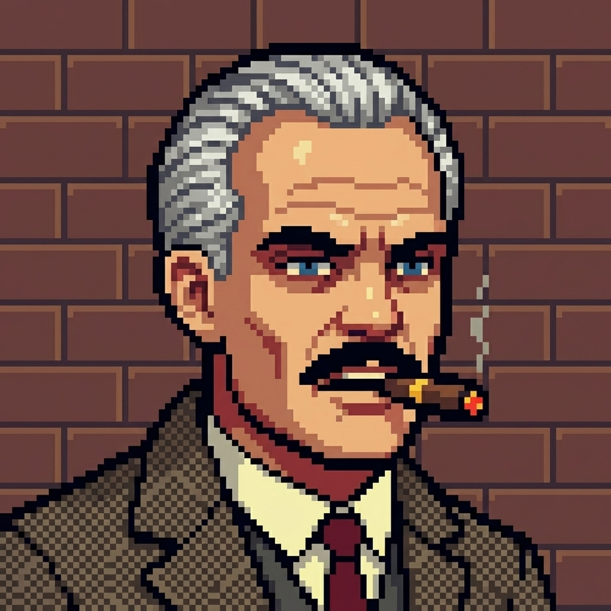

<div align="center">

<table border="0" cellpadding="10" cellspacing="0">
<tr>
<td valign="middle">

</td>
<td valign="middle">

</td>
</tr>
</table>

</div>

---

## `> whoami`

I build AI-powered systems and ship them fast.

- 🤖 **AI agent builder** — building systems that work autonomously
- 🚀 **Founder** — shipping products, not pitch decks
- 🔧 **Open source contributor** — code > talk

I don't wait for permission. I build, ship, iterate.

---

## `> pip list --format=badges`

<p>
  
  
  
  
  
</p>

---

## `> git log --oneline --graph`

<div align="center">

[](https://github.com/psychomafia-tiger)

</div>

---

## `> cat philosophy.txt`

```
build things that make money
ship things that solve problems
automate things that waste time

"talk is cheap. show me the product."
```

---

<div align="center">

*building things that work, one commit at a time*

[](https://github.com/psychomafia-tiger)

</div>
